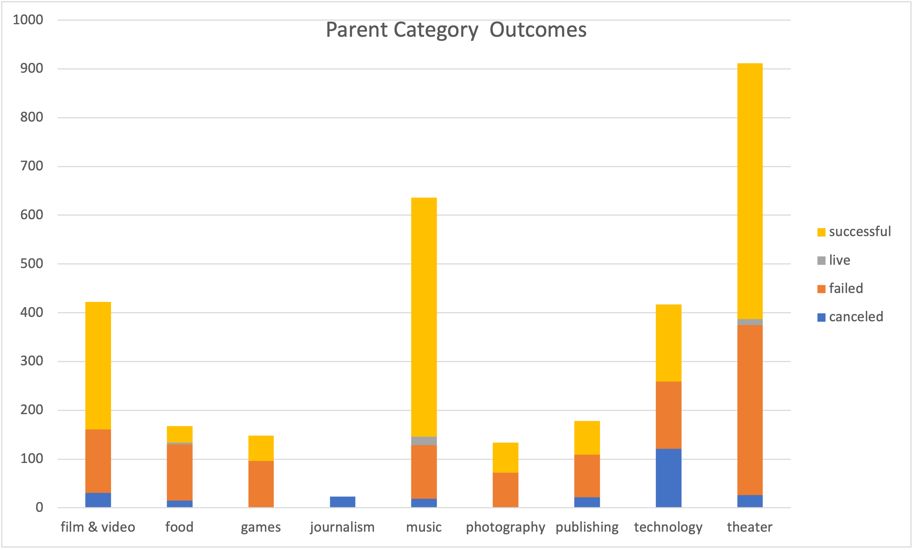
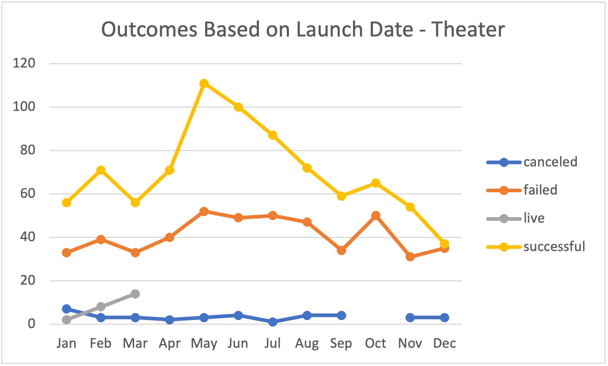
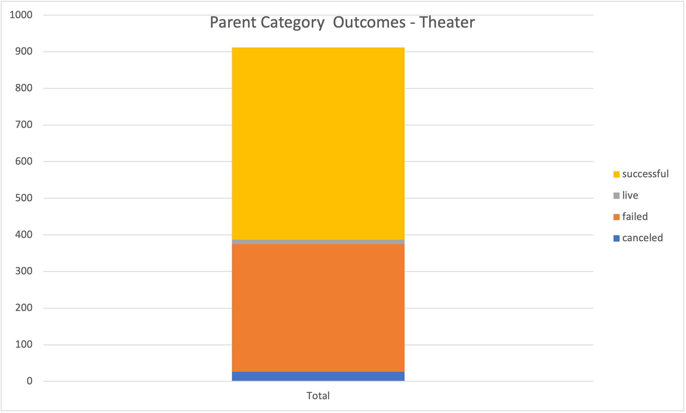

# An analysis of Kickstarter Campaings 
Performing analysis on Kickstarter Data for Louis. She wants some specific information about different categories and subcategories in US and GB. In the next image we can identify the prencipals and their Outcomes.
This image represent Outcomes by Categories in US 
This Image represent Outcomes by Subcategories in Grand Britain 
This Image represent Outcomes by Subcategories in USA 
This Image represent the Outcomes based on launch date 
This Image represent the Theater Outcomes based on launch date 
This Image represent the Parent category outcomes by Theater 
This Image represent the Outcomes in Subcatgory Plays in USA 
We can see that the Catgories that have better performance were those the experiences one (film & video, music and theater).
